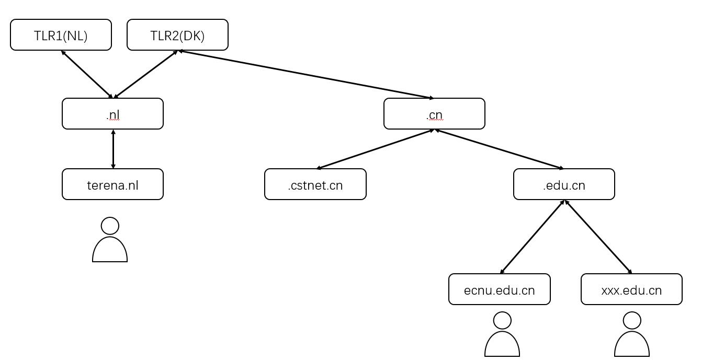
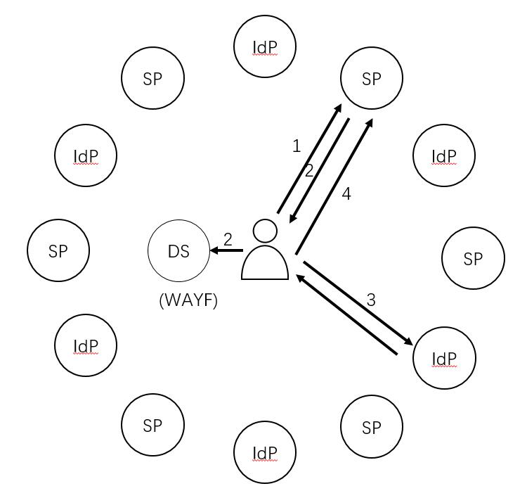

# 方案架构

### 前通道与后通道
跨校认证（上海教育认证）是一种认证的漫游，无线网络（eduroam）的漫游似乎也是一种认证的漫游。但是这两种模式的架构却是截然不同的。他们的区别在于数据交互的通道。

对于 eduroam 这样的无线漫游而言，他是一种典型的 `Backend Channel`，也就是后通道的模式。

如下图所示，Radius 的报文通过树状层次组织的服务器，层层的转发直至完成漫游。在这里认证的数据主要是直接在服务器之间转发的，服务器之间必须确保网络通讯是畅通的。所以这是**后通道**

但是对于跨校认证而言，他的所有数据实际上都是通过用户，或者更准确的说是浏览器来进行交互的。如图所示

一个跨校认证的流程简化来描述，大概是这样

- 用户（浏览器）请求 SP
- 用户（浏览器）被重定向至 (E)DS 选择 IdP
- 用户（浏览器）跳转到IdP 上认证
- 用户（浏览器）被重定向回 SP，访问资源

可以看到其实所有的交互都是通过浏览器发器的，服务器之间并没有通讯，服务器之间甚至不需要保障网络互通，只要他们到用户（浏览器）通就可以了。所以这是**前通道**

### 无感知的升级

既然前通道的模式，只需要服务器和浏览器之间可以通讯即可。那么我们就可以构建出与生成环境完全一致的本地测试服务器，并且可以与生成环境共存。

只需要通过修改本地域名解析等方式，就可以在完全不影响生产环境的情况下完成对测试服务器的测试。直至测试完成切换上线，期间生产服务器始终可以正常对外提供服务。

因此采用这个方案，IdP 的升级就完全不存在时间窗口，我们完全可以很悠闲的慢慢配置新的 IdP 服务器，慢慢完成测试，最后切换上线。

### 流程简述

1. 准备一台新的服务器
2. 安装配置 IdP4
3. 修改本地 DNS 进行本地测试
4. 测试完成切割上线